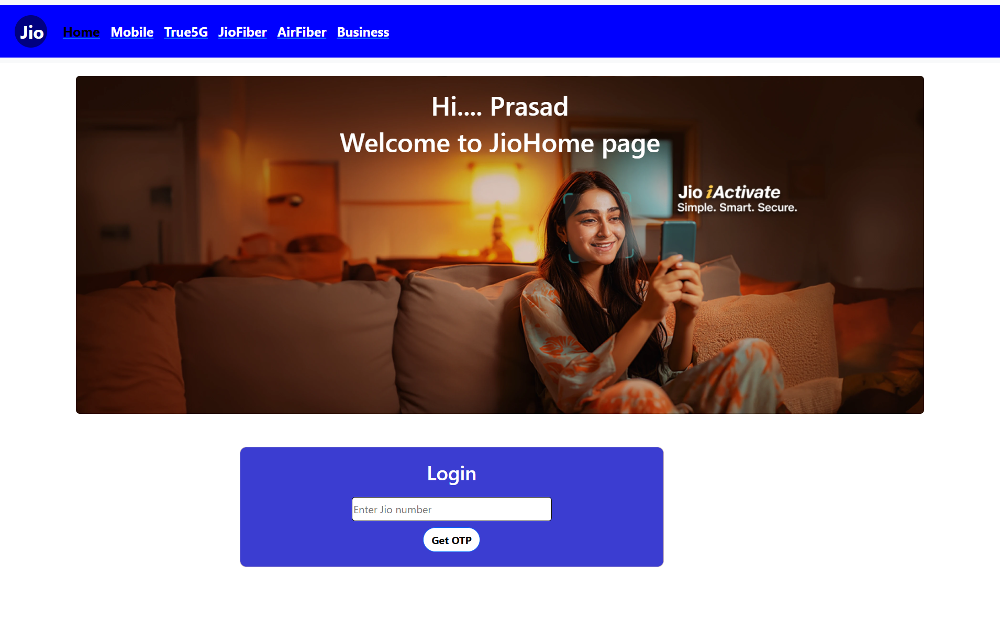

# 🌟 Days 13 & 14: Mastering React Fundamentals 🌟

The past two days have been incredibly rewarding as I delved deep into React and honed my skills in various core concepts. Here's what I accomplished:

1. React Routing:
 - Navigated between different components/pages using `react-router-dom`.
 - Utilized components like `Route`, `Switch`, `Link`, and `BrowserRouter` to set up seamless navigation in my application.

2. Props:
 - Mastered the art of passing data from parent components to child components using props.
 - Created reusable and dynamic components by leveraging props to customize content and functionality.

3. Events - onClick & onChange:
 - Handled click events with the `onClick` event handler and executed functions upon user interaction.
 - Managed input changes with the `onChange` event handler, updating state as users typed in form fields or selected options.

4. Building a Small UI:
 - Applied my knowledge to build a small, functional user interface using React.
 - Practiced structuring components, managing state, and ensuring responsive and interactive design.

